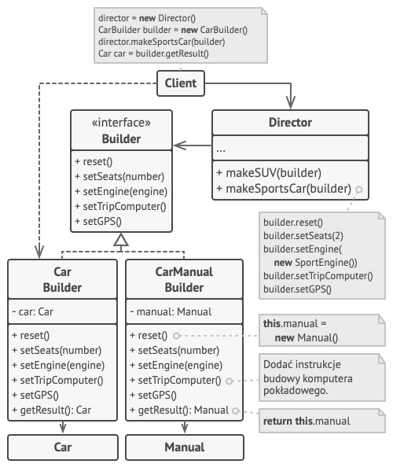

<h1>
    Builder
</h1>
<p>
    Wzorzec pozwalający budować złożone obiekty etapami. Wzorzec pozwala budować obiekty o różnych typach korzystając z 
tego samego kodu konstrukcyjnego
</p>

<p>
    Wzorzec wskazuje aby wszystko co konstrułuje obiekt przeżucić do innej klasy odpowiedzialnej tylko za tworzenie (tzw
<code>budowniczy</code>). 
</p>

```java
public interface Builder {
    public void setCarType(CarType type);
    public void setSeats(int seats);
    public void setEngine(Engine engine);
    public void setTransmission(Transmission transmission);
    public void setTripComputer(TripComputer tripComputer);
    public void setGPSNavigator(GPSNavigator gpsNavigator);
}
```
<p>
    W Javie idealnym podejściem do tego typu konstrukcji jest interfejs, który będzie narzucać jakie metody powinny mieć
klasy implementujące ten interfejs. W ten sposób nie musimy wywoływać wszystkich etapów, lecz te które są dla nas 
wymagane w danej sytuacji. W ten też sposób możemy wyspecjalizować naszego budowniczego do konkretnych sposobów jego 
działania. Dla przykładu jedna z naszych klas może się specjalizować tylko w tworzeniu auta z manualną skrzynią biegów 
itp.
</p>

```java
public class CarManualBuilder implements Builder {
    /**
     * Reszta implementacji
     */
    public Manual getResult() {
        return new Manual(type, seats, engine, transmission, tripComputer, gpsNavigator);
    }
}
```
<p>
    Kolejnym levelem w podążaniu za wzorcem jest utworzenie <code>kierownika</code>, który będzie odpowiedzialny za 
budowniczych. Kierownik jest odpowiedzialny za strukturę kolejnych etapów tworzenia obiektów. Oczywiście ten poziom nie 
jest wymagany, lecz aby zachować kolejne etapy tworzenia nowych elementów warto zaimpelemntować takie rozwiązanie. 
</p>

